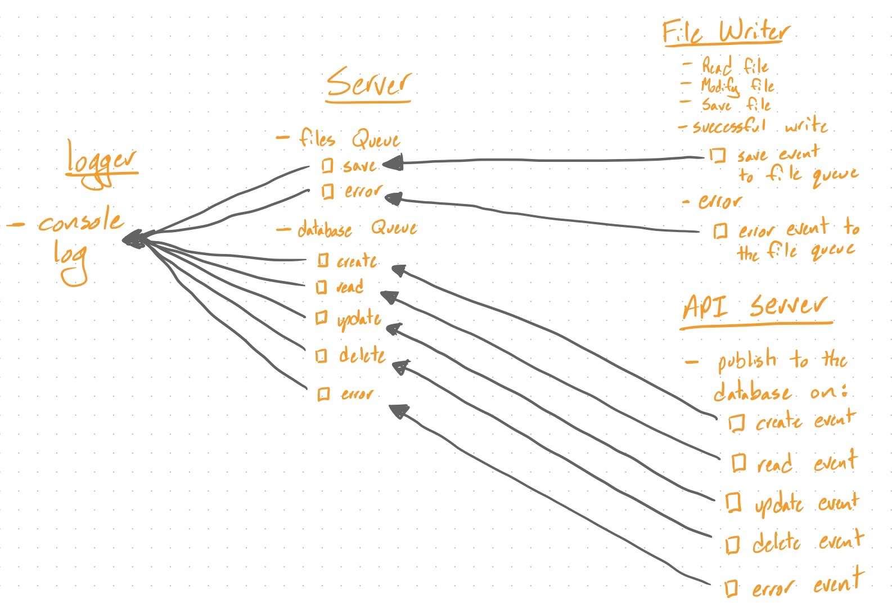

 LAB 19
=================================================

## File Writer

### Author: Jagdeep Singh

### Links and Resources
* [submission PR](https://github.com/401-advanced-javascript-js/lab-19-file-writer/pull/1)

### Setup
#### `.env` requirements

* `QUEUE_SERVER` - Full URL and PORT of your running queue server

#### Running the app
* Set `.env` variables
* Run `node start [:filename]` in root directory using terminal

  
#### Tests
No tests written, haven't gone over how to test sockets.

#### UML

